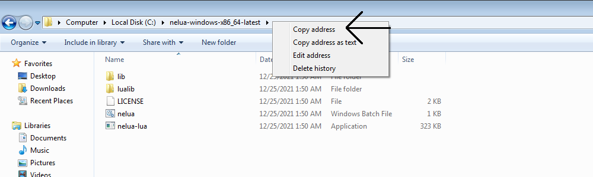

# Table of Content:

- **Windows** <br>
- **Linux** <br>
- **macOS** <br>
- **Hello World** <br>

## Windows

- You Should have either one of them: `winlibs` or `tdm-gcc` or `mingw-w64` or `w64devkit`

If you don't have any of them, you can follow this tutorial about setting up `tdm-gcc`.

- Go to the [github releases](https://github.com/edubart/nelua-lang/releases) page of the nelua-lang repository, click on the drop-down button named "assets", Then click on `nelua-windows-x86_64-latest.zip`.
- Save the file on your system, unzip the `nelua-windows-x86_64-latest.zip` file by right-clicking on the zip, then click on Extract Here.
- Open the unzipped folder, right-click on the path and click on ``Copy address`` as shown in the image below.



- Open the start menu, search for *Edit environment variables for your account*

In the *System Variables* find the *PATH* variable, select it and click on edit

In the *Edit System variables window*, click on new and paste the address, click OK and OK again. 

## Linux
- You should have GCC installed.
- Go to the [github releases](https://github.com/edubart/nelua-lang/releases) page of the nelua-lang repository, click on the drop-down button named "assets", Then click on `nelua-linux-x86_64-latest.tar.xz`.
- Unzip the tar file by running the following command in a terminal.

```bash
> tar -xf nelua-linux-x86_64-latest.tar.xz
```

- Run the following command for adding the compiler to the PATH for the current terminal session.

```bash
> export PATH="/path/to/unzipped/folder:$PATH"
```

## macOS
- You should have Clang installed.
- Go to the [github releases](https://github.com/edubart/nelua-lang/releases) page of the nelua-lang repository, click on the drop-down button named "assets", then click on ``nelua-macos-x86_64-latest.tar.xz``.
- Unzip the tar file by running the following command in a terminal.

```bash
> tar -xf nelua-macos-x86_64-latest.tar.xz
```

- Run the following command for adding the compiler to the PATH for the current terminal session.

```bash
> export PATH="/path/to/unzipped/folder:$PATH"
```

## Hello World

- Create a new file named ``HelloWorld.nelua`` and write the following code.

```lua
print("Hello World")
```

- Compile and run the ``HelloWorld.nelua`` file by running the following command in the command prompt/terminal.

```bash
> nelua HelloWorld.nelua
Hello World
```